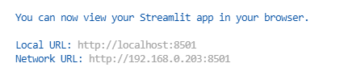
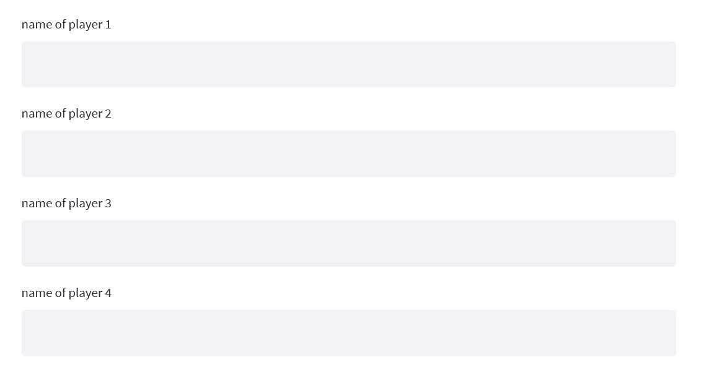

# challenge-card-game-Ujjwal-Kandel

# Description
This project is a part of the [Becode.org AI Bootcamp](https://becode.org/learn/ai-bootcamp/) program. The challange is to build a basis for a card game by using OOP in Python. 


Untill now I have implemented:
- A deck of cards is created .
- Cards are shuffled and distributed among  players.
- A running streamlit web app


# Objectives
Understand how to build a project in a OOP concept

# Repo architecture
```
Card Game Challenge
│
│README.md      :explains the project
│main.py        : on the *main.py* file are player,deck and board objects are created in order to run the program
|                 Python script file necessary to initialize the game
|requirements.txt : all the libraries that are required to run this program
│   
│__   
│   utils         :directory contains all modules required to run the game
│   │
│   │ card.py      :Python script file with the Symbol and Card classes where i define the details of the cards and their structures.
│   │
│   │ game.py      :Python script file with the Board class where i define the behaviours of the 4 players.
│   │
│   │ player.py    :Python script file with the Player and Deck classes where i define the details and behaviours of player and Deck

```

# Installation
- Clone this repository into your local environment with below command-

  `git clone https://github.com/ujjwalk00/challenge-card-game-Ujjwal-Kandel.git`

- Create python virtual environment

- Install all the required library with below command

  `pip install -r requirements.txt`

# Usage

To run application with streamlit run main.py with below command.

  `streamlit run main.py`

Application will open in browser automatically or you can also find application url in terminal like below




# Demo

 <font size="3"> After running the main.py file you will be directed to the streamlit web app where you can see user inputs for player names</font> 




<font size="3"> after entering the player names the random cards will be distributed for each players until the deck is empty</font> 


# Timeline
*October 2021*

Time limit: 3 days

This is the first project where I apply my current knowledge of OOP concepts into this project.

# Personal situation

This is a group project given to us at [BeCode](https://becode.org/)

Here is how you can contact me :

[Ujjwal Kandel](https://www.linkedin.com/in/ujjwal-kandel-10743a1bb/)

ujjwalkandel2000@gmail.com

